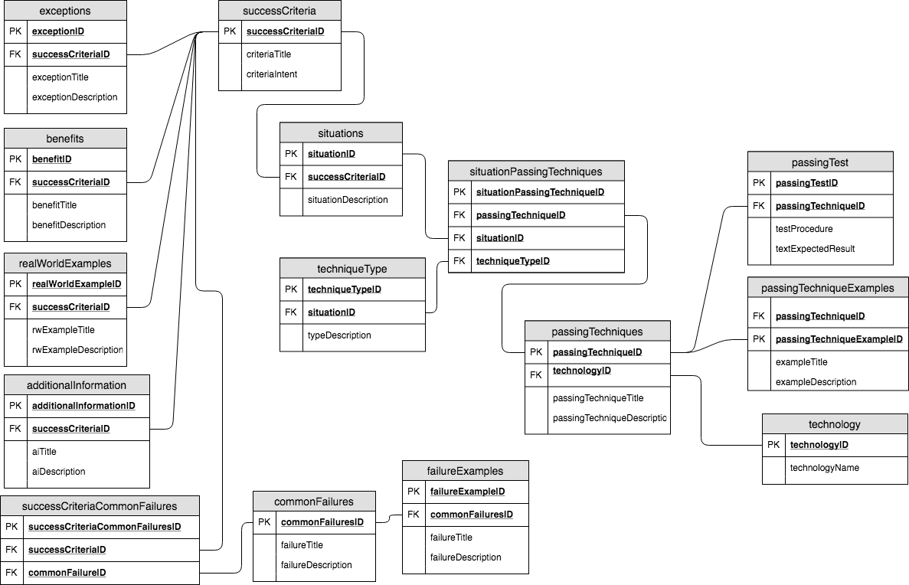

# Silver Guidelines
## DB Documentation

PK - Primary Key (used to act as identified for each table)
FK - Foreign Key (used to act as a link between tables)

The above diagram was reverse engineered from the current WCAG guideline success criteria documents. Additional information on each of the tables presented is given below.

Table | Explanation
---|---
**exceptions** | Used to detail exceptions to success criteria. E.g. CAPTCHA within SC1.1.1 (Non-Text Content)
**benefits** | Gives information on the benefits of following SC
**realWorldExamples** | Copy of Examples section from current SC page
**additionalInformation** | Copy from additional information of existing SC
**successCriteriaCommonFailures** | *Linking Table*, successCriteria can fail in many ways, failures can apply to many success criteria.
**commonFailures** | Methods that normally result in failure of meeting success criteria
**failureExamples** | Examples of common Failures
**successCriteria** | Information on success criteria including title and intent
**situations** | Gives situations where passingTechniques should apply
**situationPassingTechniques** | *Linking Table*, successCriteria can have many passingTechniques. passingTechniques can apply to many successCriteria. Passing techniques may or may not have a techniqueType
**passingTechniques** | Information on techniques that can be used to meet success criteria
**techniqueType** | Some techniques have a type that they are applied to (e.g. “Short text alternative techniques for Situation B”)
**passingTest** | Test that can be used to see if technique has been successful
**passingTechniqueExamples** | Examples that can be used
**technology** | Details on the specific technology that a passing technique may apply to
